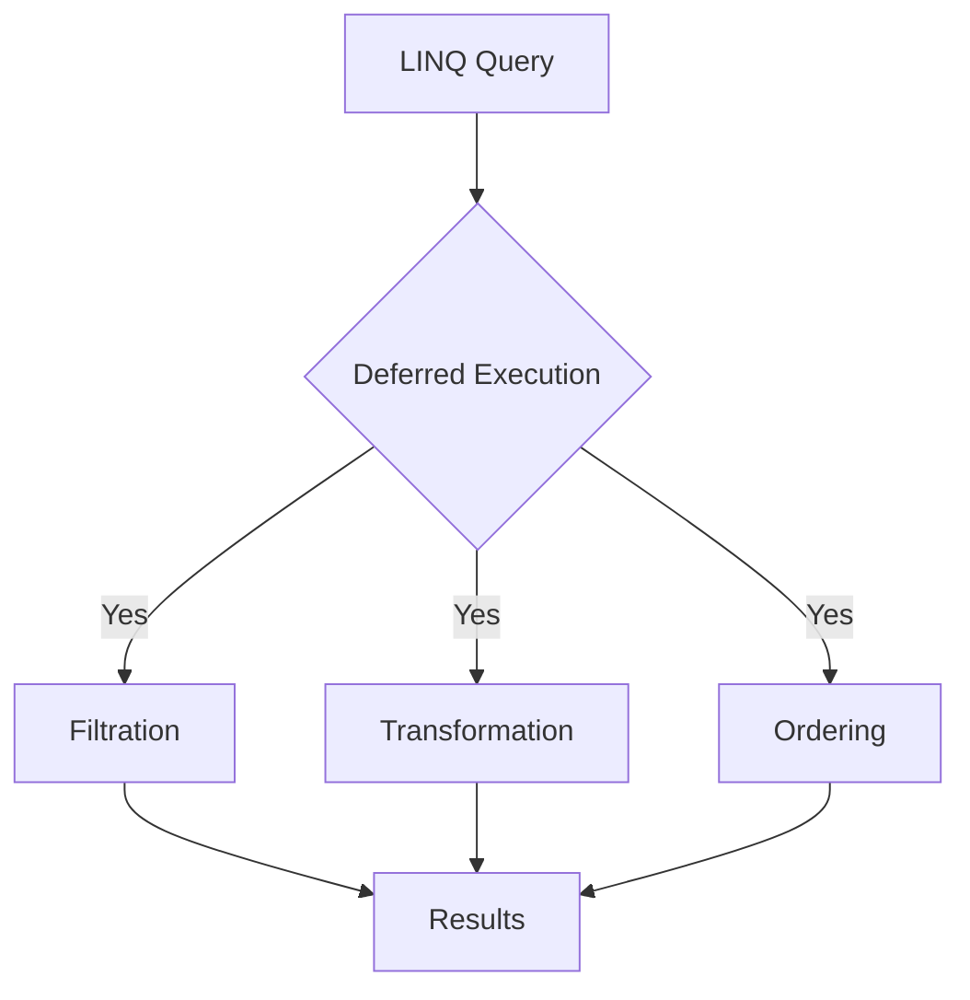
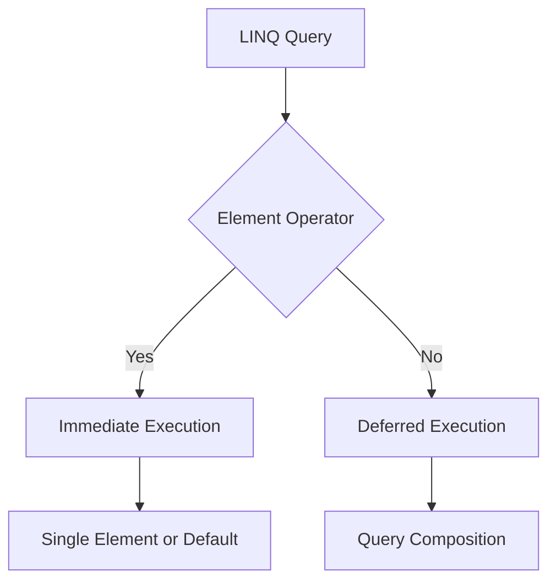

# LINQ Filtration: Where Operator

After preparing our customer list and product list, we'll now work with the first category of LINQ operators: Filtration (also known as Restriction).

## The Where Operator

The `Where` operator in LINQ is similar to the WHERE clause in SQL. It allows us to filter a sequence based on a given condition.

### Example: Finding Out-of-Stock Products

In our example, we'll use the `Where` operator to find products that are out of stock (i.e., products with `UnitsInStock` equal to 0).

## Syntax Options

LINQ provides two syntax options for using the `Where` operator:

### 1. Fluent Syntax

The fluent syntax uses extension methods. The `Where` method has two overloads, but we'll use the one that takes a `Func<T, bool>` predicate:

```csharp
var Result = ProductList.Where(P => P.UnitsInStock == 0);

foreach(var item in Result)
{
    Console.WriteLine(item);
}
```

### 2. Query Syntax

The query syntax resembles SQL but is written in the order of execution. It must start with `from` and end with `select` or `group by`:

```csharp
var Result = from P in ProductList
             where P.UnitsInStock == 0
             select P;

foreach(var item in Result)
{
    Console.WriteLine(item);
}
```

## Sample Output

Based on the product data provided, the output might look like this:

```
ProductID:5,ProductName:Chef Anton's Gumbo Mix,CategoryCondiments,UnitPrice:21.3500,UnitsInStock:0
ProductID:17,ProductName:Alice Mutton,CategoryMeat/Poultry,UnitPrice:39.0000,UnitsInStock:0
ProductID:29,ProductName:Thüringer Rostbratwurst,CategoryMeat/Poultry,UnitPrice:123.7900,UnitsInStock:0
ProductID:31,ProductName:Gorgonzola Telino,CategoryDairy Products,UnitPrice:12.5000,UnitsInStock:0
ProductID:53,ProductName:Perth Pasties,CategoryMeat/Poultry,UnitPrice:32.8000,UnitsInStock:0
```

## Key Points

- The `Where` operator filters a sequence based on a predicate.
- It can be used with both fluent and query syntax.
- The condition `UnitsInStock == 0` identifies out-of-stock products.
- Both syntax options produce the same result.

This filtration technique is fundamental in LINQ and can be applied to various scenarios where you need to narrow down a dataset based on specific criteria.


## Multiple Conditions

We can use multiple conditions in the Where clause to further refine our filter. Here's an example to get products that are in stock (UnitsInStock > 0) and belong to the "Meat/Poultry" category:

### Fluent Syntax
```csharp
var Result = ProductList.Where(P => P.UnitsInStock > 0 && P.Category == "Meat/Poultry");
```

### Query Expression
```csharp
Result = from P in ProductList
         where P.UnitsInStock > 0 && P.Category == "Meat/Poultry"
         select P;
```

## Displaying Results
```csharp
foreach (var item in Result)
    Console.WriteLine(item);
```

Based on the provided data, the output might look like:
```
ProductID:9,ProductName:Mishi Kobe Niku,CategoryMeat/Poultry,UnitPrice:97.0000,UnitsInStock:29
ProductID:54,ProductName:Tourtière,CategoryMeat/Poultry,UnitPrice:7.4500,UnitsInStock:21
ProductID:55,ProductName:Pâté chinois,CategoryMeat/Poultry,UnitPrice:24.0000,UnitsInStock:115
```

## Indexed Where (Overload)

The Where method has a second overload that takes a Func with two parameters: the element and its index. This allows for filtering based on element position in the sequence.

### Syntax
```csharp
var Result = ProductList.Where((P, I) => I < 10 && P.UnitsInStock == 0);
```

This query gets out-of-stock products from the first 10 elements in the ProductList.

### Important Notes:
- Indexed Where is only available in fluent syntax.
- It cannot be written with query expression syntax.

Based on the provided data, this might return:
```
ProductID:5,ProductName:Chef Anton's Gumbo Mix,CategoryCondiments,UnitPrice:21.3500,UnitsInStock:0
```

## Key Points

1. The Where operator can use multiple conditions combined with logical operators (&&, ||, etc.).
2. Indexed Where allows filtering based on both element properties and position in the sequence.
3. Indexed Where is exclusive to fluent syntax.

This concludes the overview of filtration operators in LINQ, demonstrating various ways to use the Where clause for precise data filtering.


# LINQ Transformation (Projection) Operators: Select and SelectMany

## Select Operator

The `Select` operator transforms each element in a sequence into a new form.

### Use Case: Selecting Product Names

To get only the product names from our product list:

#### Fluent Syntax
```csharp
var Result = ProductList.Select(P => P.ProductName);
```

#### Query Syntax
```csharp
Result = from P in ProductList
         select P.ProductName;
```

### Output Example
```
Filo Mix
Perth Pasties
Tourtière
Pâté chinois
Gnocchi di nonna Alice
...
```

## SelectMany Operator

`SelectMany` is used when you need to flatten nested sequences (e.g., arrays within arrays).

### Use Case: Selecting Customer Orders

When dealing with customers who have multiple orders:

#### Fluent Syntax
```csharp
var Result = CustomerList.SelectMany(C => C.Orders);
```

#### Query Syntax
```csharp
Result = from C in CustomerList
         from O in C.Orders
         select O;
```

### Output Example
```
Order Id: 10643, Date: 8/25/1997, Total: 814.50
Order Id: 10692, Date: 10/3/1997, Total: 878.00
Order Id: 10702, Date: 10/13/1997, Total: 330.00
Order Id: 10835, Date: 1/15/1998, Total: 845.80
Order Id: 10952, Date: 3/16/1998, Total: 471.20
Order Id: 11011, Date: 4/9/1998, Total: 933.50
Order Id: 10308, Date: 9/18/1997, Total: 88.80
Order Id: 10625, Date: 8/8/1997, Total: 479.75
Order Id: 10759, Date: 11/28/1997, Total: 320.00
...

```

## Key Differences

- `Select`: Transforms each element but keeps the overall structure (one-to-one mapping).
- `SelectMany`: Flattens nested sequences into a single sequence (one-to-many mapping).

## Important Notes

1. `Select` is used for simple transformations where each input element produces one output element.
2. `SelectMany` is used when each input element can produce multiple output elements, typically when dealing with nested collections.
3. The choice between `Select` and `SelectMany` depends on the structure of your data and the desired output.

By understanding these transformation operators, you can efficiently reshape and extract data from complex object structures in LINQ queries.


## Comparison with Select

If we had used `Select` instead of `SelectMany`:

```csharp
var Result = CustomerList.Select(C => C.Orders);
```

The output would have been a sequence of order arrays, one for each customer, rather than a flattened list of all orders.
```
Demo01.Data.Order[]
Demo01.Data.Order[]
Demo01.Data.Order[]
...
```

## Key Differences (Updated)

- `Select`: Returns a new sequence where each element is the result of applying a transform function to each source element. In the case of customer orders, it would return a sequence of order arrays.
- `SelectMany`: Flattens a sequence of sequences, returning a single sequence with all nested elements. For customer orders, it returns a single sequence containing all orders from all customers.

## Important Notes

1. Use `Select` when you want to transform each element but keep the overall structure of your data.
2. Use `SelectMany` when you need to flatten nested sequences into a single sequence, as shown in the customer orders example.
3. `SelectMany` is particularly useful when dealing with one-to-many relationships in your data model.

Understanding the difference between these operators allows you to effectively manipulate and query complex data structures in LINQ.


# Advanced LINQ Select Operations

## 1. Selecting Multiple Properties

When you need to select more than one property, you can create an anonymous type.

### Fluent Syntax
```csharp
var Result = ProductList.Select(P => new {
    ProductID = P.ProductID,
    ProductName = P.ProductName
});
```

### Query Syntax
```csharp
var Result = from P in ProductList
             select new { 
                 ProductID = P.ProductID, 
                 ProductName = P.ProductName 
             };
```

### Output Example
```
{ ProductID = 52, ProductName = Filo Mix }
{ ProductID = 53, ProductName = Perth Pasties }
{ ProductID = 54, ProductName = Tourtière }
...
```

## 2. Complex Queries: Filtering and Transforming

You can combine Where and Select to filter and transform data in one query.

### Fluent Syntax
```csharp
var DiscountedProductList = ProductList
    .Where(P => P.UnitInStock > 0)
    .Select(P => new {
        Id = P.ProductID,
        Name = P.ProductName,
        OldPrice = P.UnitPrice,
        NewPrice = P.UnitPrice - (P.UnitPrice * 0.1M)
    });
```

### Query Syntax
```csharp
var DiscountedProductList = from P in ProductList
                            where P.UnitInStock > 0
                            select new {
                                Id = P.ProductID,
                                Name = P.ProductName,
                                OldPrice = P.UnitPrice,
                                NewPrice = P.UnitPrice - (P.UnitPrice * 0.1M)
                            };
```

### Output Example
```
{ Id = 51, Name = Manjimup Dried Apples, OldPrice = 53.0000, NewPrice = 47.70000 }
{ Id = 52, Name = Filo Mix, OldPrice = 7.0000, NewPrice = 6.30000 }
{ Id = 54, Name = Tourtière, OldPrice = 7.4500, NewPrice = 6.70500 }
...
```

## 3. Indexed Select

The Select method has an overload that provides the index of each item.

### Fluent Syntax (Only)
```csharp
var Result = ProductList
    .Where(P => P.UnitInStock > 0)
    .Select((P, I) => new { 
        Index = I, 
        ProductName = P.ProductName 
    });
```

### Output Example
```
{ Index = 46, ProductName = Manjimup Dried Apples }
{ Index = 47, ProductName = Filo Mix }
{ Index = 48, ProductName = Tourtière }
...
```

## Key Points

1. Use anonymous types to select multiple properties.
2. You can chain Where and Select for complex queries.
3. The indexed Select is only available in fluent syntax.
4. Anonymous types allow you to create temporary data structures without defining a formal class.

These advanced Select operations allow for powerful data transformations and projections in LINQ queries.


# LINQ Ordering Operators

LINQ provides several operators for ordering sequences. These operators allow you to sort data based on one or more properties in ascending or descending order.

## Basic Ordering Operators

### OrderBy
The `OrderBy` operator sorts elements in ascending order.

#### Fluent Syntax
```csharp
var result = ProductList.OrderBy(p => p.UnitPrice);
```

#### Query Syntax
```csharp
var result = from p in ProductList
             orderby p.UnitPrice
             select p;
```

### OrderByDescending
The `OrderByDescending` operator sorts elements in descending order.

#### Fluent Syntax
```csharp
var result = ProductList.OrderByDescending(p => p.UnitPrice);
```

#### Query Syntax
```csharp
var result = from p in ProductList
             orderby p.UnitPrice descending
             select p;
```

## Multiple Property Ordering

You can order by multiple properties using the `ThenBy` and `ThenByDescending` operators.

### Fluent Syntax
```csharp
var result = ProductList.OrderByDescending(p => p.UnitPrice)
                        .ThenBy(p => p.UnitsInStock);

var result2 = ProductList.OrderByDescending(p => p.UnitPrice)
                         .ThenByDescending(p => p.UnitsInStock);
```

### Query Syntax
```csharp
var result = from p in ProductList
             orderby p.UnitPrice descending, p.UnitsInStock descending
             select p;
```

## Additional Operators

### Where
The `Where` operator is used for filtering elements based on a condition.

```csharp
var result = ProductList.Where(p => p.UnitsInStock == 0);
```

### Reverse
The `Reverse` operator reverses the order of elements in a sequence.

```csharp
var result = ProductList.Where(p => p.UnitsInStock == 0).Reverse();
```

## Comparison Table: Fluent Syntax vs Query Syntax

| Operation | Fluent Syntax | Query Syntax |
|-----------|---------------|--------------|
| Ascending Order | `OrderBy(p => p.Property)` | `orderby p.Property` |
| Descending Order | `OrderByDescending(p => p.Property)` | `orderby p.Property descending` |
| Multiple Properties | `OrderBy().ThenBy()` | `orderby Property1, Property2` |

## Execution Behavior



All these operators (filtration, transformation, ordering) use deferred execution. This means the query is not executed immediately when it's defined, but rather when the results are actually needed (e.g., when iterating over the results or calling a method like `ToList()`).


# LINQ Element Operators

## Key Characteristic: Immediate Execution

Unlike many LINQ operators that use deferred execution, Element Operators execute immediately.

## Basic Element Operators

### First()

Retrieves the first element in a sequence.

```csharp
var result = ProductList.First();
Console.WriteLine(result.ProductName);
```

### Last()

Retrieves the last element in a sequence.

```csharp
var result = ProductList.Last();
Console.WriteLine(result.ProductName);
```

## Handling Null Results

To avoid null reference exceptions, use the null-conditional and null-coalescing operators:

```csharp
Console.WriteLine(result?.ProductName ?? "Not Found");
```

## Dealing with Empty Sequences

`First()` and `Last()` throw exceptions when used on empty sequences:

```csharp
List<Product> emptyList = new List<Product>();
var result = emptyList.First(); // Throws: Sequence contains no elements
```

### FirstOrDefault() and LastOrDefault()

These methods return the default value of the type (usually null for reference types) when the sequence is empty:

```csharp
var result = emptyList.FirstOrDefault();
Console.WriteLine(result?.ProductName ?? "Not Found");

result = emptyList.LastOrDefault();
Console.WriteLine(result?.ProductName ?? "Not Found");
```

## Conditional Element Operators

These operators accept a predicate to filter elements before selection.

### First() with Predicate

```csharp
var result = ProductList.First(p => p.UnitsInStock == 0);
Console.WriteLine(result?.ProductName ?? "Not Found");
```

### Last() with Predicate

```csharp
var result = ProductList.Last(p => p.UnitsInStock == 0);
Console.WriteLine(result?.ProductName ?? "Not Found");
```

### Handling Failed Conditions

When no elements satisfy the condition, these methods throw exceptions:

```csharp
var result = ProductList.Last(p => p.UnitsInStock > 1000); // Throws if no match
```

### FirstOrDefault() and LastOrDefault() with Predicate

These methods return the default value when no elements satisfy the condition:

```csharp
var result = ProductList.FirstOrDefault(p => p.UnitsInStock > 1000);
Console.WriteLine(result?.ProductName ?? "Not Found");

result = ProductList.LastOrDefault(p => p.UnitsInStock > 1000);
Console.WriteLine(result?.ProductName ?? "Not Found");
```

## Comparison Table: Element Operators

| Operator | Empty Sequence | No Match (with predicate) |
|----------|----------------|---------------------------|
| First() | Throws Exception | Throws Exception |
| Last() | Throws Exception | Throws Exception |
| FirstOrDefault() | Returns Default | Returns Default |
| LastOrDefault() | Returns Default | Returns Default |

## Execution Behavior



Element Operators trigger immediate execution of the query, unlike most other LINQ operators which use deferred execution.


# LINQ Element Operators

## Key Characteristic: Immediate Execution

Unlike many LINQ operators that use deferred execution, Element Operators execute immediately.

## Index-Based Element Operators

### ElementAt()

Retrieves the element at a specific index in a sequence.

```csharp
var result = ProductList.ElementAt(10);
Console.WriteLine(result?.ProductName ?? "Not Found");
```

If the index is out of range, it throws an exception:

```csharp
var result = ProductList.ElementAt(1000); // Throws: ArgumentOutOfRangeException
```

### ElementAtOrDefault()

Similar to ElementAt(), but returns the default value if the index is out of range:

```csharp
var result = ProductList.ElementAtOrDefault(1000);
Console.WriteLine(result?.ProductName ?? "Not Found");
```

## Single-Element Operators

### Single()

Returns the only element in a sequence, throwing an exception if there's not exactly one element.

```csharp
var result = ProductList.Single();
Console.WriteLine(result?.ProductName ?? "Not Found");
```

Behavior:
- If sequence has exactly one element: Returns that element
- If sequence is empty: Throws InvalidOperationException
- If sequence has more than one element: Throws InvalidOperationException

### SingleOrDefault()

Similar to Single(), but returns the default value if the sequence is empty.

```csharp
var result = ProductList.SingleOrDefault();
Console.WriteLine(result?.ProductName ?? "Not Found");
```

Behavior:
- If sequence has exactly one element: Returns that element
- If sequence is empty: Returns default value (null for reference types)
- If sequence has more than one element: Throws InvalidOperationException

### Single() and SingleOrDefault() with Predicate

These methods also have overloads that accept a predicate:

```csharp
var result = ProductList.SingleOrDefault(p => p.UnitPrice > 4);
Console.WriteLine(result?.ProductName ?? "Not Found");
```

Behavior:
- If exactly one element matches the condition: Returns that element
- If no elements match the condition: Returns default value (SingleOrDefault) or throws exception (Single)
- If more than one element matches the condition: Throws InvalidOperationException

## Comparison Table: Element Operators

| Operator | Empty Sequence | Single Element | Multiple Elements | No Match (with predicate) |
|----------|----------------|-----------------|-------------------|---------------------------|
| First() | Throws Exception | Returns Element | Returns First Element | Throws Exception |
| Last() | Throws Exception | Returns Element | Returns Last Element | Throws Exception |
| FirstOrDefault() | Returns Default | Returns Element | Returns First Element | Returns Default |
| LastOrDefault() | Returns Default | Returns Element | Returns Last Element | Returns Default |
| ElementAt(index) | Throws Exception | Returns if index valid | Returns if index valid | N/A |
| ElementAtOrDefault(index) | Returns Default | Returns if index valid | Returns if index valid | N/A |
| Single() | Throws Exception | Returns Element | Throws Exception | Throws Exception |
| SingleOrDefault() | Returns Default | Returns Element | Throws Exception | Returns Default |

## Execution Behavior


Element Operators trigger immediate execution of the query, unlike most other LINQ operators which use deferred execution.

## Important Note

Element operators are only available in fluent syntax. They cannot be used directly in query syntax.
